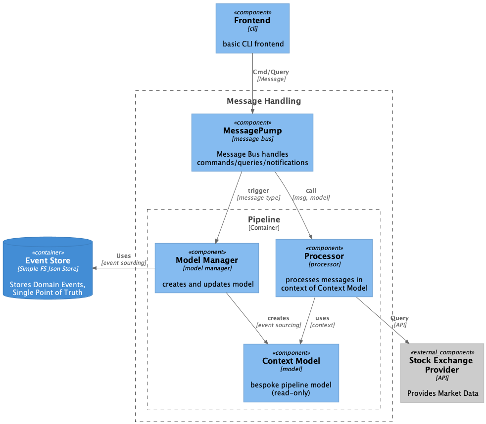
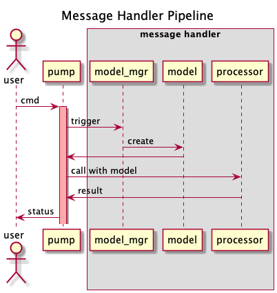

# Food_truck Architecture

A simple Stock Portfolio application with external market data access
in order to explore ideas and concepts presented in:
https://ralfw.de/food-truck-architecture-its-all-about-events/



## Ideas
- System is Event-Sourced
- There is one unified pipeline for Commands, Queries and Notifications handling
- Only commands generate events to document application state changes; 
  that means context models only really get updated after command processing.
- Notifications don’t create events directly, but commands which in turn create events. 
  (This should also make clear that events are just internal data to record what’s happened. 
  If something happened in the environment of a software system then that’s received as notifications. 
  And since notifications by their very nature are no requests and don’t try to elicit a response, 
  handling them can only mean producing commands.)
- All contexts and context models are read-only. 
  If changes are made to them during the message processing stage, they will be discarded afterwards. 
  Changes to the application state beyond processing a message have to be encoded in events written to the event stream. 
  The event stream is holding the ever changing state truth of an application.
- Loading and updating context models is working only with events as data source. No other resources are used.



## Setup
```sh
# Install dependencies
pipenv install --dev

# run CLI application
make run

# run tests
make test
```

# Resources
https://www.reddit.com/r/softwarearchitecture/comments/bpc12d/eventorientation_as_the_new_default_for/

